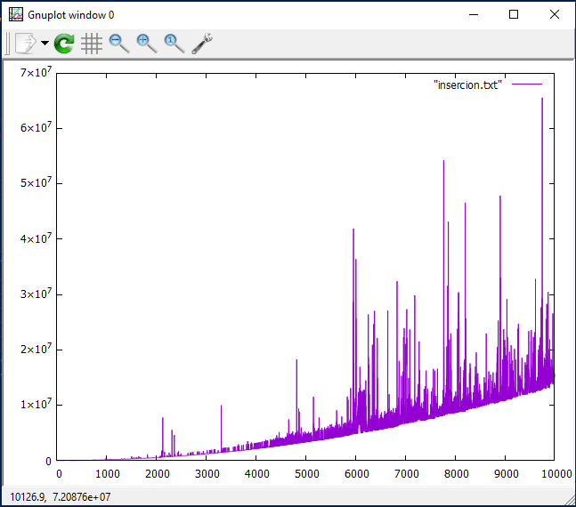
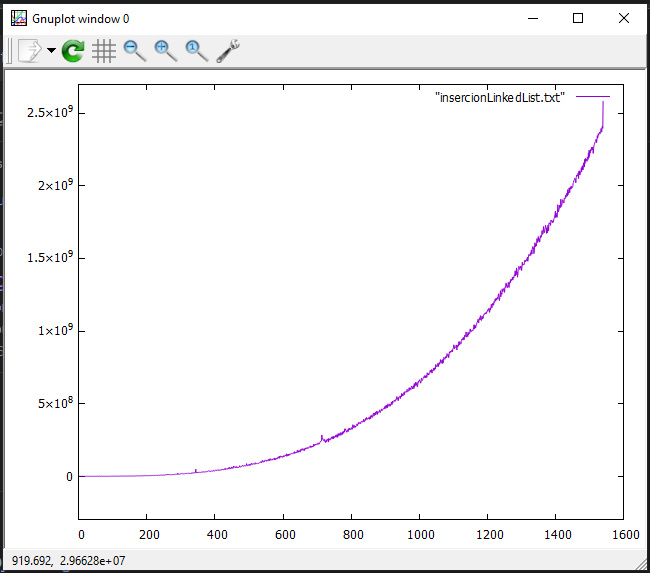
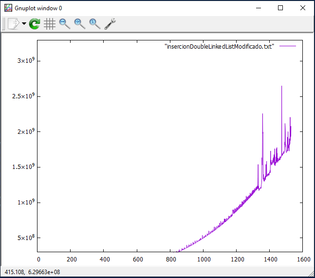

<div align="center">
<table>
    <theader>
        <tr>
            <td></td>
            <th>
                <span style="font-weight:bold;">UNIVERSIDAD NACIONAL DE SAN AGUSTIN</span><br />
                <span style="font-weight:bold;">FACULTAD DE INGENIERÍA DE PRODUCCIÓN Y SERVICIOS</span><br />
                <span style="font-weight:bold;">DEPARTAMENTO ACADÉMICO DE INGENIERÍA DE SISTEMAS E INFORMÁTICA</span><br />
                <span style="font-weight:bold;">ESCUELA PROFESIONAL DE INGENIERÍA DE SISTEMAS</span>
            </th>
            <td></td>
        </tr>
    </theader>
    <tbody>
        <tr><td colspan="3"><span style="font-weight:bold;">Formato</span>: Guía de Práctica de Laboratorio</td></tr>
        <tr><td><span style="font-weight:bold;">Aprobación</span>:  2022/03/01</td><td><span style="font-weight:bold;">Código</span>: GUIA-PRLD-001</td><td><span style="font-weight:bold;">Página</span>: 1</td></tr>
    </tbody>
</table>
</div>

<div align="center">
<span style="font-weight:bold;">INFORME DE LABORATORIO</span><br />
</div>


<table>
<theader>
<tr><th colspan="6">INFORMACIÓN BÁSICA</th></tr>
</theader>
<tbody>
<tr><td>ASIGNATURA:</td><td colspan="5">Estructura de Datos y Algoritmos</td></tr>
<tr><td>TÍTULO DE LA Laboratorio:</td><td colspan="5">Sort y Listas Enlazadas</td></tr>
<tr>
<td>NÚMERO DE PRÁCTICA:</td><td>04</td><td>AÑO LECTIVO:</td><td>2022 A</td><td>NRO. SEMESTRE:</td><td>III</td>
</tr>
<tr>
<td>FECHA INICIO::</td><td>06-Jun-2022</td><td>FECHA FIN:</td><td>10-Jun-2022</td><td>DURACIÓN:</td><td>02 horas</td>
</tr>
<tr><td colspan="6">RECURSOS:
    <ul>
        <li>https://www.w3schools.com/java/</li>
        <li>https://www.eclipse.org/downloads/packages/release/2022-03/r/eclipse-ide-enterprise-java-and-web-developers</li>
        <li>https://javaplot.panayotis.com/</li>
        <li>https://sourceforge.net/projects/gnuplot/files/gnuplot/5.4.3/</li>
    </ul>
</td>
</<tr>
<tr><td colspan="6">DOCENTES:
<ul>
<li>Richart Smith Escobedo Quispe - rescobedoq@unsa.edu.pe</li>
</ul>
</td>
</<tr>
</tdbody>
</table>

# Sort y Listas Enlazadas

## ORGANIZACION

Los ficheros estan organizados:

```
├───.vscode
├───bin
│   ├───Ejercicios
│   ├───Examples
│   └───TDA
├───Imagenes
├───lib
└───src
    ├───Ejercicios
    ├───Examples
    └───TDA

```

Los archivos dentro de gitginore son:
- bin carpeta donde estan los archivos class
- lib
- .vscode

## Problemas 

JavaPlot dentro de la Libreria JavaPlot no se pudo encontrar en el archivo jar 

### Herramientas usadas
- Visual Studio Code con la extension "extension pack for java" que contiene los elemtos necesarios para ejecutar archivos java 
y "vim" que simula el uso de vim en vs code
- GNU - Plot

### Objetivos 
- Estudiar el algoritmo de ordenamiento por inserción.
- Utilizar Listas Enlazadas para guardar los datos y ejecutar el algoritmo de ordenamiento.

## RESOLUCION

### Ejercicio 1
Utilizar el tipo generico de Lista Enlazada para generar los peores casos y ejecutar el algoritmo de ordenamiento.

Para la resolucion de este ejercicio se requirio principalmente de tres metodos:

- Metodo add() que consiste en agregar un elemento al final de la lista
- Metod get() que consiste en obtener un elemento en el index deseado
- Metodo set() que cambia un elemento en el index mencionado

### Ejercicio 2

Utilizar el tipo generico de Doble Lista Enlazada para generar los peores casos y ejecutar el algoritmo de ordenamiento.

Los metodos usados son similares al del anterior ejercicio con la diferencia de que en vez de node se usa un DoubleNode y que se añade una linea de codigo para enlazar el elemento con el anterior


### Metodo de insercion
El metodo consta de un dato generico que deriva de la clase comparable

```java
    public static <E extends Comparable<E>> long insertionSort(DoubleLinkedList<E> lista) {
        E key;
        int i;
        long nano_startTime = System.nanoTime();
        for (int j = 1; j < lista.size(); j++) {
            key = lista.get(j);
            i = j - 1;
            //Aqui hace el cambio con cada elemento que sea menor que la llave usando compareTo
            while (i > -1 && lista.get(i).compareTo(key) > 0) {
                lista.set(i + 1, lista.get(i));
                i--;
            }
            lista.set(i + 1, key);
        }
        long nano_endTime = System.nanoTime();
        return nano_endTime - nano_startTime;

    }
```


### Procedimiento

Se simulo una serie de listas con peor caso, el tiempo que requirio ejecutar el ordenamiento de estas listas se ingreso a un archivo y se ejecuto con el Programa GNUPlot y en la computadora del usuario. Los datos del ejemplo llegaron sin complicaciones a 10000 sin embargo con las listas enlazadas solamente se llego a un promedio maximo  de 1530
```
plot "insercionLinkedList.txt" with lines
```
comando ejecutado en GNUPLOT para el Ejercicio 1 - LinkedList
```
plot "insercionDoubleLinkedList.txt" with lines
```
Comando ejecutado en GNUPLOT para el Ejercicio 2 - DoubleLinkedList
Tambien se hizo una grafica con el ejemplo dado para comparar.

## Resultados
Los resultados fueron los siguientes:

El ejemplo inicial<br>
<br>


Para El ejercicio 1:<br>
<br>


Para el Ejercicio 2<br>
<br>


Modificando el DoubleLinkedList
<br>


Resumiendo

|                 | Estandar | LinkedList | DoubleLinkedList | Modify DoubleLinkedList |
|-----------------|----------|------------|------------------|-------------------------|
| Tiempo mas bajo | 500      | 46200      | 32600            | 34200                   |
| Tiempo 1530     | 325500   | 2499662100 | 2491664500       | 2077890400              |
| Tiempo 10000    | 15621700 | ---------- | ---------------- | --------------          |


## CONCLUSIONES

Al analizar el algoritmo de insercion con las diferentes metodos se observa que ordenar una lista estandar no requiere de muchos recursos como una lista que ha sido 
implementada con POO, Ya que para acceder a un elemento de los arreglos estandar solamente toma 1 en tiempo de ejecucion mientras que en una lista enlazada se tiene 
que recorrer todos los nodos para llegar al elemento que se quiere obtener. Por eso es que en la computadora donde se efectuo estas pruebas los datos que se obtuvieron 
de las ordenaciones de una lista estandar llegaron a los 10000, mientras con los demas llego a un promedio maximo de 1530.
LinkedList y DoubleLinkedList tiene cierto parecido salvo que al insertar y/o cambiar un nodo DoubleLinkedList requiere de unos cuantos movimientos mas. Sin embargo
LinkedList puede ir de derecha-izquierda como de izquierda-derecha evaluando primero el index

```java
    public E get(int index) {
        if (index < 0 || index >= this.size()) 
            throw new IndexOutOfBoundsException();
        int i = 0;
        // En esta parte se evalua si el metodo caminara de derecha-izquierda o izquierda-derecha para cambiar el nodo
        if (index < size / 2) {
            DoubleNode<E> tmp = this.first;
            while (i < index) {
                tmp = tmp.getNext();
                i++;
            }
            return tmp.getData();
        } else {
            DoubleNode<E> tmp = this.last;
            index = size - index - 1;
            while (i < index) {
                tmp = tmp.getPrev();
                i++;
            }
            return tmp.getData();
        }
```

Inicialmente los metodos eran similares a linked list. Sin embargo solo al añadir la comprobacion hace que el metodo de ordenacion sea mas eficiente que LinkedList.

## CUESTIONARIO

- ¿Cómo se ejecutaría sus implementaciones desde terminal(consola)? 
Tanto en el tutorial de uso de JavaPlot como en una pregunta de stack overflow:
Para primero compilar
```
javac -cp ".:/home/path/mail.jar:/home/path/servlet.jar" MyJavaFile.java
```
Donde lo que esta entre parentesis es la ubicacion en la computadora del jar y el -cp se refiere a classpath este archivo que se crea al crear un nuevo proyecto
en eclipse, en este archivo se indica la direccion de los archivos .class (Usualmente se guardan en bin) y de los archivos java(en src)

Para la ejecucion
``` 
java -cp ".:/home/path/mail.jar:/home/path/servlet.jar" MyJavaFile.java

``` 
En visualstudio las instruccion estan en una carpeta .vscode donde esta el archivo settings.json un ejemplo seria al ejecutar un proyecto java en VisualStudioCode

``` 
/EDALaboratorio04> c:; cd 'c:\Users\PXNDX\eclipse-workspace\EDALaboratorio04'; & 'C:\Program Files\Java\jdk-18.0.1\bin\java.exe' '--enable-preview' '-XX:+ShowCodeDetailsInExceptionMessages' '-cp' 'C:\Users\Alumno\eclipse-workspace\EDALaboratorio04\bin' 'Ejercicios.Ejercicio1'

``` 


## RETROALIMENTACION


## REFERENCIAS

```
https://javaplot.panayotis.com/
https://stackoverflow.com/questions/9395207/how-to-include-jar-files-with-java-file-and-compile-in-command-prompt
``` 

