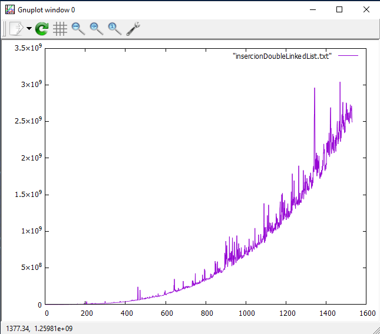

<div align="center">
<table>
    <theader>
        <tr>
            <td></td>
            <th>
                <span style="font-weight:bold;">UNIVERSIDAD NACIONAL DE SAN AGUSTIN</span><br />
                <span style="font-weight:bold;">FACULTAD DE INGENIERÍA DE PRODUCCIÓN Y SERVICIOS</span><br />
                <span style="font-weight:bold;">DEPARTAMENTO ACADÉMICO DE INGENIERÍA DE SISTEMAS E INFORMÁTICA</span><br />
                <span style="font-weight:bold;">ESCUELA PROFESIONAL DE INGENIERÍA DE SISTEMAS</span>
            </th>
            <td></td>
        </tr>
    </theader>
    <tbody>
        <tr><td colspan="3"><span style="font-weight:bold;">Formato</span>: Guía de Práctica de Laboratorio</td></tr>
        <tr><td><span style="font-weight:bold;">Aprobación</span>:  2022/03/01</td><td><span style="font-weight:bold;">Código</span>: GUIA-PRLD-001</td><td><span style="font-weight:bold;">Página</span>: 1</td></tr>
    </tbody>
</table>
</div>

<div align="center">
<span style="font-weight:bold;">INFORME DE LABORATORIO</span><br />
</div>


<table>
<theader>
<tr><th colspan="6">INFORMACIÓN BÁSICA</th></tr>
</theader>
<tbody>
<tr><td>ASIGNATURA:</td><td colspan="5">Estructura de Datos y Algoritmos</td></tr>
<tr><td>TÍTULO DE LA Laboratorio:</td><td colspan="5">Sort y Listas Enlazadas</td></tr>
<tr>
<td>NÚMERO DE PRÁCTICA:</td><td>04</td><td>AÑO LECTIVO:</td><td>2022 A</td><td>NRO. SEMESTRE:</td><td>III</td>
</tr>
<tr>
<td>FECHA INICIO::</td><td>06-Jun-2022</td><td>FECHA FIN:</td><td>10-Jun-2022</td><td>DURACIÓN:</td><td>02 horas</td>
</tr>
<tr><td colspan="6">RECURSOS:
    <ul>
        <li>https://www.w3schools.com/java/</li>
        <li>https://www.eclipse.org/downloads/packages/release/2022-03/r/eclipse-ide-enterprise-java-and-web-developers</li>
        <li>https://javaplot.panayotis.com/</li>
        <li>https://sourceforge.net/projects/gnuplot/files/gnuplot/5.4.3/</li>
    </ul>
</td>
</<tr>
<tr><td colspan="6">DOCENTES:
<ul>
<li>Richart Smith Escobedo Quispe - rescobedoq@unsa.edu.pe</li>
</ul>
</td>
</<tr>
</tdbody>
</table>

# Sort y Listas Enlazadas

## ORGANIZACION

Los ficheros estan organizados:

```
├───.vscode
├───bin
│   ├───Ejercicios
│   ├───Examples
│   └───TDA
├───Imagenes
├───lib
└───src
    ├───Ejercicios
    ├───Examples
    └───TDA

```

Los archivos dentro de gitginore son:
- bin carpeta donde estan los archivos class
- lib
- .vscode

## Problemas 

JavaPlot dentro de la Libreria JavaPlot no se pudo encontrar en el archivo jar 

### Herramientas usadas
- Visual Studio Code con la extension "extension pack for java" que contiene los elemtos necesarios para ejecutar archivos java 
y "vim" que simula el uso de vim en vs code
- GNU - Plot

### Objetivos 
- Estudiar el algoritmo de ordenamiento por inserción.
- Utilizar Listas Enlazadas para guardar los datos y ejecutar el algoritmo de ordenamiento.

## RESOLUCION

### Ejercicio 1
Utilizar el tipo generico de Lista Enlazada para generar los peores casos y ejecutar el algoritmo de ordenamiento.

Para la resolucion de este ejercicio se requirio principalmente de tres metodos:
Metodo add() que consiste en agregar un elemento al final de la lista
```java
    public boolean add(E e) {
    //comprueba si el root esta vacio
        if(root == null) {
            root = new Node<E>(e);
            size++;
            return true;
        }
        //recorre todo el arreglo para que al final agrege el elemento
        Node<E> tmp = this.root;
        while (tmp.getNext() != null) {
            tmp = tmp.getNext();
        }
        tmp.setNext(new Node<E>(e));
        size++;
        return true;
    }
```

Metod get() que consiste en obtener un elemento en el index deseado

```java
    public E get(int index) {
        if(index < 0 || index >= this.size()) // comprobar de acuerdo al tamaño del arreglo
            throw new IndexOutOfBoundsException();
        //recorre desde root hasta el index deseado
        int i = 0;
        Node<E> tmp = this.root;
        while(i < index) {
            tmp = tmp.getNext();
            i++;
        }
        return tmp.getData();
    }
```
Metodo set() que cambia un elemento en el index mencionado

```java
    public E set(int index, E element) {
        if(index < 0 || index >= this.size())// comprobacion segun el index que se ingresa
            throw new IndexOutOfBoundsException();
        //recorre toda la lista hasta el index -1
        int i = 0;
        index--;
        Node<E> tmp = this.root;
        while (i < index) {
            tmp = tmp.getNext();
            i++;
        }
        E data = tmp.getNext().getData();
        // cambio de valor en el index
        tmp.setNext(new Node<E>(element, tmp.getNext().getNext()));
        return data;
    }
```

### Ejercicio 2

Utilizar el tipo generico de Doble Lista Enlazada para generar los peores casos y ejecutar el algoritmo de ordenamiento.

Los metodos usados son similares al del anterior ejercicio con la diferencia de que en vez de node se usa un DoubleNode y que se añade una linea de codigo para enlazar el elemento con el anterior

### Procedimiento

Se simulo una serie de listas con peor caso, el tiempo que requirio ejecutar el ordenamiento de estas listas se ingreso a un archivo y se ejecuto con el Programa GNUPlot
```
plot "insercionLinkedList.txt" with lines
```
comando ejecutado en GNUPLOT para el Ejercicio 1 - LinkedList
```
plot "insercionDoubleLinkedList.txt" with lines
```
Comando ejecutado en GNUPLOT para el Ejercicio 2 - DoubleLinkedList

Los resultados fueron los siguientes:

Para El ejercicio 1:<br>
<br>


Para el Ejercicio 2<br>
<br>


## CONCLUSIONES

Al analizar Los diferentes metodos con las diferentes metodos se observan algunas diferencias
- LinkedList es mas suavizado que DoubleLinkedList
- El tiempo de ejecucion a diferencia de un arreglo estandar es mayor sin embargo es mas suavizada que al usar un arreglo estandar. En una lista enlazada no se puede
obtener el dato directamente se requiere recorrer cada nodo del arreglo para acceder al nodo que se requiere, lo mismo pasa con DoubleLinkedList. Al analizar los
graficos nos damos cuenta de que esta desventaja no es notoria a simple vista y es facil pensar que linked List es mas lento para ordenar a comparacion de un arreglo
 estandar. DoubleLinkedList parece el mas desnivelado de todos pero se puede usar maneras para tratar de suavizar un poco la curva una manera es ya no
 yendo de Primero a n sino de Ultimo a n para acceder/cambiar los datos.

## CUESTIONARIO

- ¿Cómo se ejecutaría sus implementaciones desde terminal(consola)? 
Tanto en el tutorial de uso de JavaPlot como en una pregunta de stack overflow:
Para primero compilar
```
javac -cp ".:/home/path/mail.jar:/home/path/servlet.jar" MyJavaFile.java
```
Donde lo que esta entre parentesisi es la ubicacion en la computadora del jar y el -cp se refiere a classpath este archivo que se crea al crear un nuevo proyecto
en eclipse, en este archivo se indica la direccion de los archivos .class (Usualmente se guardan en bin) y de los archivos java(en src)

Para la ejecucion
``` 
java -cp ".:/home/path/mail.jar:/home/path/servlet.jar" MyJavaFile.java

``` 
## RETROALIMENTACION


## REFERENCIAS

```
https://javaplot.panayotis.com/
https://stackoverflow.com/questions/9395207/how-to-include-jar-files-with-java-file-and-compile-in-command-prompt
``` 

